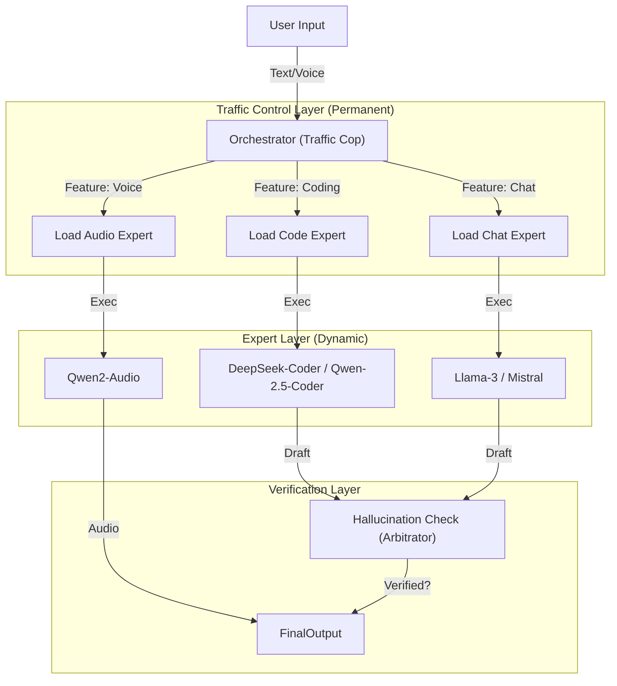

# Architecture V2: Local Orchestrator & Dynamic Swarm

## 1. Overview
This document proposes an architectural evolution for ZenAI, moving from a single general-purpose LLM to a **Router-Expert Pattern**. This mimics modern cloud architectures (like GPT-4's MoE) but runs entirely locally by dynamically swapping models based on task complexity and available hardware resources.



## 2. The Orchestrator "Traffic Manager"
Instead of using a heavy model for everything, we use a **permanent, lightweight, high-speed model** (~3B parameters) to classify user intent and manage resources.

### Recommended Models
1.  **Qwen 2.5-3B-Instruct**:
    *   **Pros**: Excellent function calling (best in class for size), very fast, low VRAM usage (<2GB).
    *   **Role**: Analyze intent ("Is this a coding task?"), extract parameters, and decide which "Expert" to load.
2.  **Phi-3-Mini (3.8B)**:
    *   **Pros**: Strong reasoning, widely supported.
    *   **Cons**: Slightly weaker function calling than Qwen 2.5.

**Decision**: **Qwen 2.5-3B** is the recommended local orchestrator due to superior tool-use benchmarks.

## 2.5 Verification Layer (Arbitrator)
To prevent hallucinations, especially in the Expert Layer, we introduce a **Verification Layer**.
*   **Role**: Cross-checks the Expert's draft response against retrieving source documents (RAG) or runs a logical consistency check.
*   **Mechanism**:
    1.  Expert generates a draft.
    2.  Arbitrator (lightweight model) compares Draft vs. Sources.
    3.  If contradiction detected -> Regenerate or flag as "Uncertain".

## 3. Emotional Voice Integration (Qwen2-Audio)
To achieve "emotional" interactions, we integrate **Qwen2-Audio**.

*   **Capability**: Unlike standard TTS (which is monotonic), Qwen2-Audio understands prosody and emotion from text instructions.
*   **Workflow**:
    1.  User input is processed by the Orchestrator.
    2.  If voice output is requested, the text response + emotion tag (e.g., `[Excited]`) is sent to Qwen2-Audio.
    3.  Qwen2-Audio generates the waveform.
*   **Hardware Requirement**: Audio models are VRAM intensive. We must unload the text LLM before loading the audio model if VRAM is < 12GB.

## 4. Dynamic Model Selection (RAM-Aware)
We implement a `ResourceManager` that checks system health (`psutil`) before loading experts.

| System RAM | Orchestrator | Expert Tier | Strategy |
| :--- | :--- | :--- | :--- |
| **< 8 GB** | Qwen-1.5-1.8B | Q4_K_M (Small) | **Serial Mode**: Unload Orchestrator -> Load Expert -> Generate -> Unload Expert -> Load Orchestrator. Slow but functional. |
| **8 - 16 GB** | Qwen-2.5-3B | Q4_K_M (7B) | **Swapping**: Keep Orchestrator in RAM. Swap Experts (Chat <-> Code) as needed. |
| **> 16 GB** | Qwen-2.5-3B | Q6/Q8 (7B+) | **Parallel**: Keep Orchestrator + 1 Expert loaded. Pre-load next expert in background. |

### Implementation Logic
```python
def load_expert(task_type):
    available_ram = psutil.virtual_memory().available
    
    # 1. Check if we need to unload current model
    if available_ram < REQUIRED_BUFFER:
        unload_current_model()
        
    # 2. Select Expert
    if task_type == "CODE":
        model = "deepseek-coder-6.7b.gguf"
    elif task_type == "CREATIVE":
        model = "mistral-7b.gguf"
    
    # 3. Load
    llm.load(model)
```

## 5. Summary
1.  **Orchestrator**: Use **Qwen 2.5-3B** running permanently.
2.  **Voice**: Integrate **Qwen2-Audio** for emotional synthesis (on-demand loading).
3.  **Efficiency**: Use a RAM-aware loading strategy to ensure "free" local models run reliably without crashing the system.
